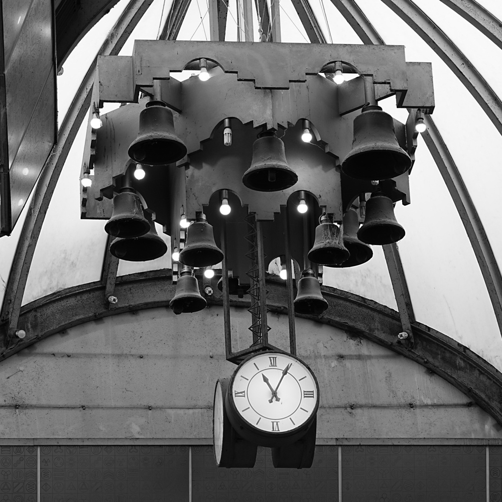
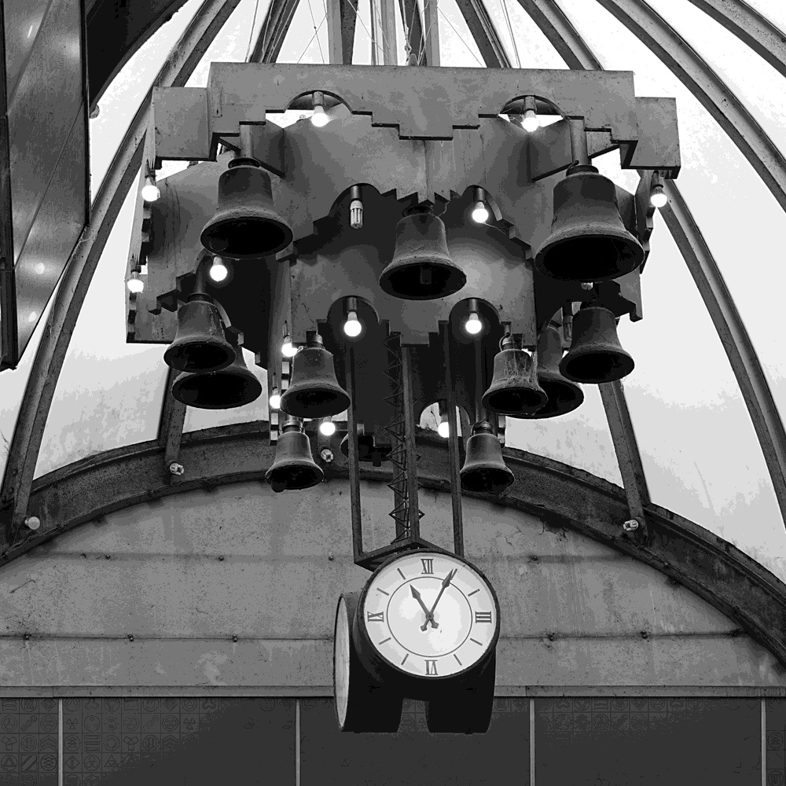
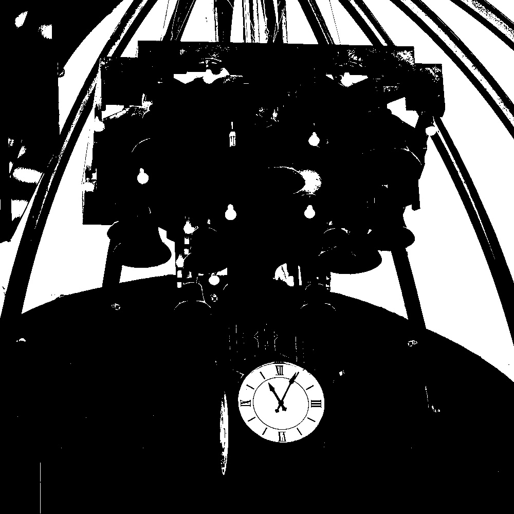
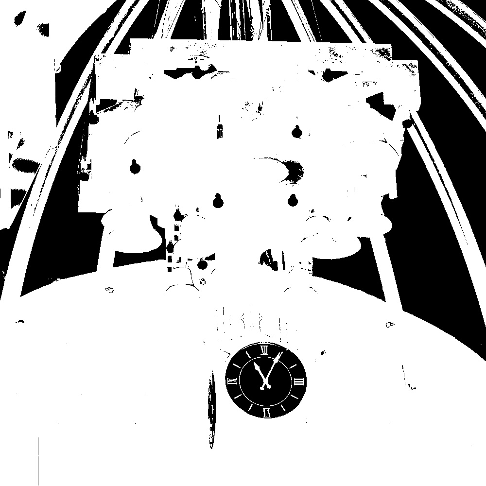
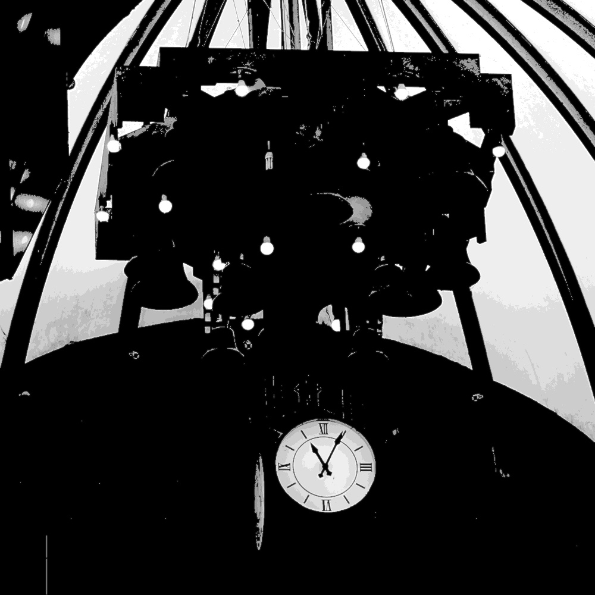

# HW1

## Problem 1

Binary Image 是二值化的图像，因此像素值为 $0$ 或 $255$，对于仅以 $1bit$ 表示的情况，其像素值为 $0$ 或 $1$，其数字化灰度为（部分）：
$$
\begin{matrix}
255 & 0 & 255 & 255 & 255 \\
255 & 255 & 255 & 255 & 255 \\
255 & 255 & 255 & 255 & 255 \\
0 & 0 & 0 & 0 & 0 \\ 
255 & 255 & 0 & 0 & 0 \\
\end{matrix}
$$
Grayscale Image 是灰度图，以 $8bit$ 灰度图为例，其像素值为 $0\sim255$，因此数字化灰度为（部分）：
$$
\begin{matrix}
217 & 241 & 242 & 241 & 242 \\
132 & 244 & 247 & 245 & 245 \\
79 & 82 & 80 & 77 & 72 \\
77 & 4 & 87 & 187 & 225 \\ 
248 & 248 & 248 & 248 & 248 \\
\end{matrix}
$$
RBG Image 是三通道彩色图，因此其每个像素均具有 $R\ G\ B$ 三种颜色，每种颜色值均为 $0\sim255$ 因此数字化灰度为（部分）：
$$
\begin{matrix}
49 & 88 & 127 \\
41 & 84 & 123 \\
46 & 86 & 128 \\ 
56 & 98 & 141 \\ 
54 & 96 & 138 \\
\end{matrix}
$$

## Problem 2

此部分要求对灰度图进行位深压缩，此处给出压缩后的图片

$8bit$



$4bit$



$1bit$



不难看出，位深越低，图像断层越明显，保留的特征越少。

## Problem 3

此部分要求对 $1bit$ 图像进行反转，得到的图像为



## Problem 4

此部分将 $4bit$ 和 $1bit$ 图像合并，尝试在与 $1bit$ 图片体积相近的情况下保存更多信息。经过测试，$1bit$ 图片的大小为 $169KB$，而此处的合并图片大小为 $167KB$。



## 代码

```Python
import cv2
import numpy as np

image = cv2.imread("1.jpg")
if image is None:
    raise ValueError("Image not found. Make sure '1.jpg' exists in the directory.")

grayscale_img = cv2.cvtColor(image, cv2.COLOR_BGR2GRAY)

cv2.imwrite("grayscale_image.jpg", grayscale_img)

# Problem 1
_, binary_img = cv2.threshold(grayscale_img, 0, 255, cv2.THRESH_BINARY + cv2.THRESH_OTSU)
cv2.imwrite("binary_image.jpg", binary_img)

np.savetxt("binary_values.txt", binary_img, fmt="%d")
np.savetxt("grayscale_values.txt", grayscale_img, fmt="%d")
np.savetxt("rgb_values.txt", image.reshape(-1, 3), fmt="%d")

# Problem 2
def convert_to_4bit(img):
    return np.round(img / 255 * 15).astype(np.uint8) * (255 / 15)

def convert_to_1bit(img):
    _, binary = cv2.threshold(img, 0, 255, cv2.THRESH_BINARY + cv2.THRESH_OTSU)
    return binary

gray_8bit = grayscale_img 
gray_4bit = convert_to_4bit(grayscale_img)
gray_1bit = convert_to_1bit(grayscale_img)

cv2.imwrite("gray_8bit.jpg", gray_8bit)
cv2.imwrite("gray_4bit.jpg", gray_4bit)
cv2.imwrite("gray_1bit.jpg", gray_1bit)

# Problem 3
binary_inverted = cv2.bitwise_not(binary_img)
cv2.imwrite("binary_inverted.jpg", binary_inverted)

# Problem 4
def merge_images(binary_img, gray_4bit):
    binary_mask = binary_img > 0  
    
    merged_img = np.zeros_like(gray_4bit) 
    merged_img[binary_mask] = gray_4bit[binary_mask] 
   
    merged_img = cv2.GaussianBlur(merged_img, (5, 5), 0)  
    merged_img[binary_mask] = gray_4bit[binary_mask]  
    
    return merged_img

merged_image = merge_images(gray_1bit, gray_4bit)

cv2.imwrite("merged_image.jpg", merged_image)
```

