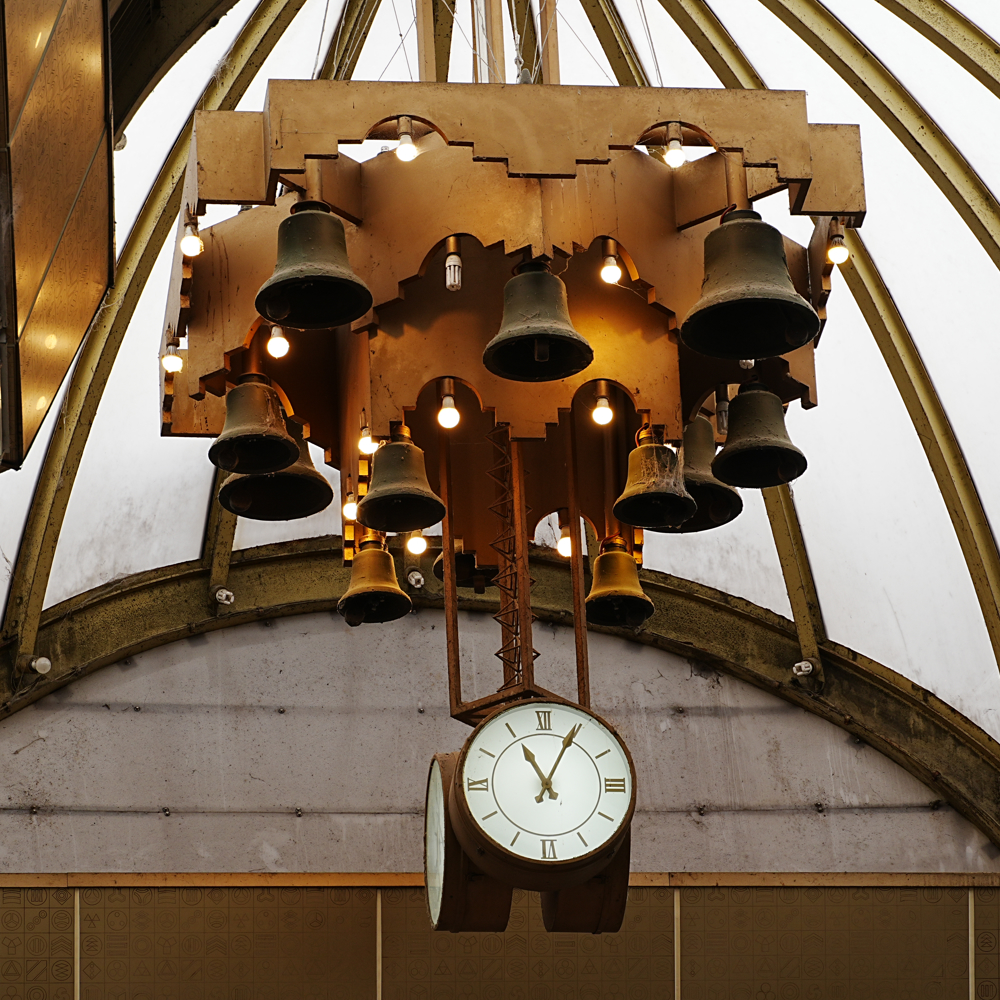
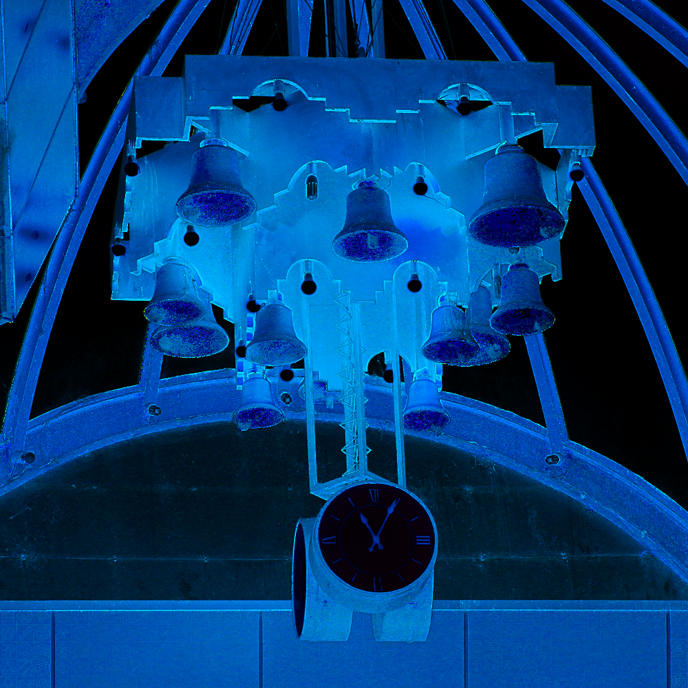
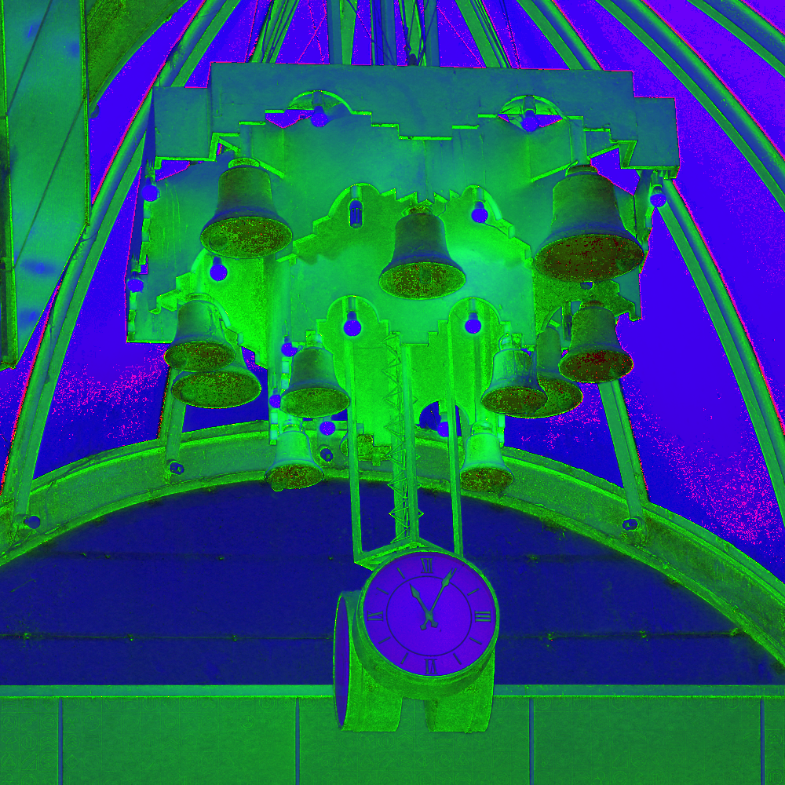
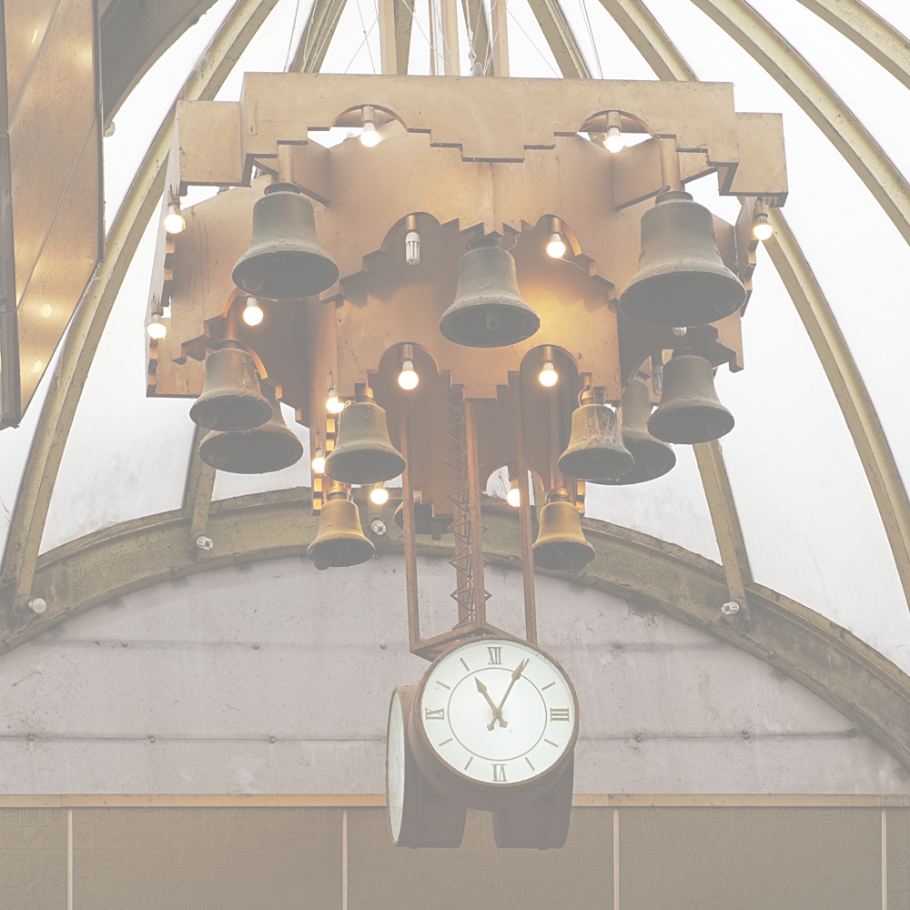
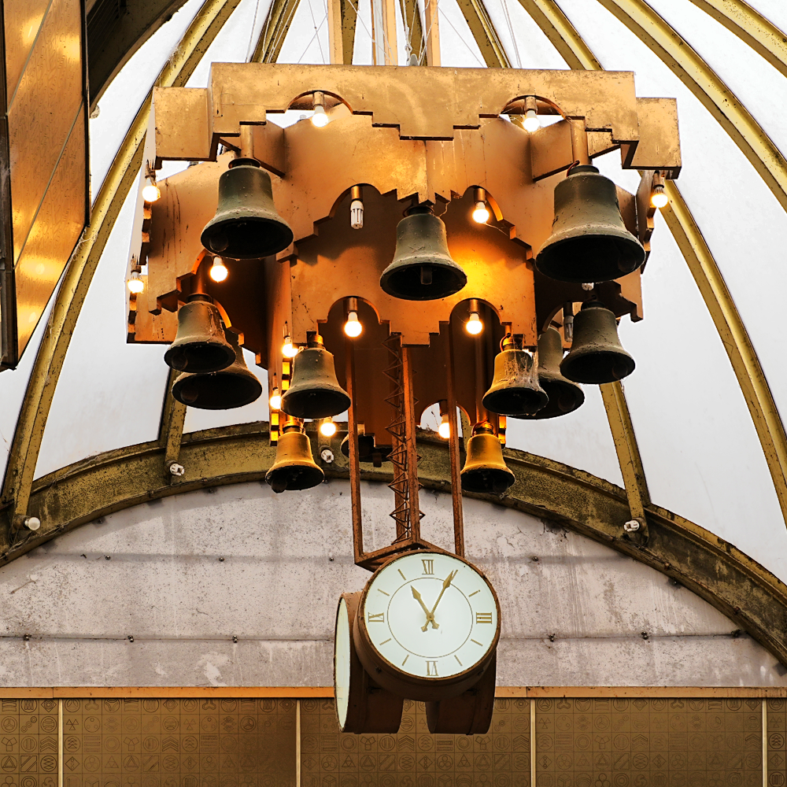

# HW1

## Problem 1

原图


RGB



CMYK



HSI



## Problem 2

CMY空间线性变换



## Problem 3

HSI直方图均衡



## Code

```Python
import cv2
import numpy as np
import matplotlib.pyplot as plt
import os

# 读取图像并转换为RGB
bgr = cv2.imread('1.jpg')
rgb = cv2.cvtColor(bgr, cv2.COLOR_BGR2RGB)

# 创建输出文件夹
output_dir = 'output_images'
os.makedirs(output_dir, exist_ok=True)

# ------------ RGB → CMYK ------------
def rgb_to_cmyk(rgb_img):
    rgb = rgb_img.astype(float) / 255
    K = 1 - np.max(rgb, axis=2)
    C = (1 - rgb[..., 0] - K) / (1 - K + 1e-8)
    M = (1 - rgb[..., 1] - K) / (1 - K + 1e-8)
    Y = (1 - rgb[..., 2] - K) / (1 - K + 1e-8)
    C[np.isnan(C)] = 0
    M[np.isnan(M)] = 0
    Y[np.isnan(Y)] = 0
    CMYK = (np.stack((C, M, Y, K), axis=2) * 255).astype(np.uint8)
    return CMYK

# ------------ RGB → HSI ------------
def rgb_to_hsi(rgb_img):
    rgb = rgb_img.astype(np.float32) / 255
    R, G, B = rgb[..., 0], rgb[..., 1], rgb[..., 2]
    num = 0.5 * ((R - G) + (R - B))
    den = np.sqrt((R - G)**2 + (R - B)*(G - B)) + 1e-8
    theta = np.arccos(num / den)
    H = np.where(B <= G, theta, 2 * np.pi - theta)
    H = H / (2 * np.pi)
    min_rgb = np.minimum(np.minimum(R, G), B)
    S = 1 - 3 * min_rgb / (R + G + B + 1e-8)
    I = (R + G + B) / 3
    HSI = np.stack((H, S, I), axis=2)
    return (HSI * 255).astype(np.uint8), HSI

# ------------ HSI → RGB ------------
def hsi_to_rgb(H, S, I):
    H = H * 2 * np.pi
    R = np.zeros_like(H)
    G = np.zeros_like(H)
    B = np.zeros_like(H)

    # RG sector
    idx = (H < 2*np.pi/3)
    B[idx] = I[idx] * (1 - S[idx])
    R[idx] = I[idx] * (1 + S[idx]*np.cos(H[idx]) / np.cos(np.pi/3 - H[idx]))
    G[idx] = 3*I[idx] - (R[idx] + B[idx])

    # GB sector
    idx = (H >= 2*np.pi/3) & (H < 4*np.pi/3)
    H2 = H[idx] - 2*np.pi/3
    R[idx] = I[idx] * (1 - S[idx])
    G[idx] = I[idx] * (1 + S[idx]*np.cos(H2) / np.cos(np.pi/3 - H2))
    B[idx] = 3*I[idx] - (R[idx] + G[idx])

    # BR sector
    idx = (H >= 4*np.pi/3)
    H2 = H[idx] - 4*np.pi/3
    G[idx] = I[idx] * (1 - S[idx])
    B[idx] = I[idx] * (1 + S[idx]*np.cos(H2) / np.cos(np.pi/3 - H2))
    R[idx] = 3*I[idx] - (G[idx] + B[idx])

    rgb = np.stack([R, G, B], axis=2)
    return np.clip(rgb * 255, 0, 255).astype(np.uint8)

# ------------ 功能1：保存 RGB、CMYK、HSI 图像 ------------
cmyk = rgb_to_cmyk(rgb)
hsi_img, hsi_float = rgb_to_hsi(rgb)

cv2.imwrite(os.path.join(output_dir, 'rgb.png'), cv2.cvtColor(rgb, cv2.COLOR_RGB2BGR))
cv2.imwrite(os.path.join(output_dir, 'cmyk_cmy.png'), cv2.cvtColor(cmyk[..., :3], cv2.COLOR_RGB2BGR))  # 只保存 CMY 部分
cv2.imwrite(os.path.join(output_dir, 'hsi.png'), cv2.cvtColor(hsi_img, cv2.COLOR_RGB2BGR))

# ------------ 功能2：CMY 空间线性变换 (变暗) ------------
cmy = 255 - rgb
factor = 0.5
cmy_transformed = np.clip(cmy * factor, 0, 255).astype(np.uint8)
rgb_from_cmy = 255 - cmy_transformed
cv2.imwrite(os.path.join(output_dir, 'cmy_linear_transform.png'), cv2.cvtColor(rgb_from_cmy, cv2.COLOR_RGB2BGR))

# ------------ 功能3：HSI 空间直方图均衡 ------------
I = hsi_float[..., 2]
I_eq = cv2.equalizeHist((I * 255).astype(np.uint8)) / 255.0
H, S = hsi_float[..., 0], hsi_float[..., 1]
rgb_histeq = hsi_to_rgb(H, S, I_eq)
cv2.imwrite(os.path.join(output_dir, 'hsi_hist_equalized.png'), cv2.cvtColor(rgb_histeq, cv2.COLOR_RGB2BGR))
```

