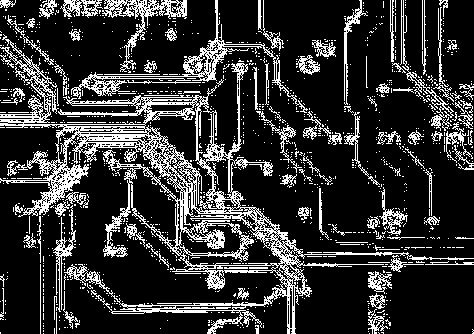
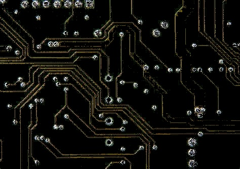
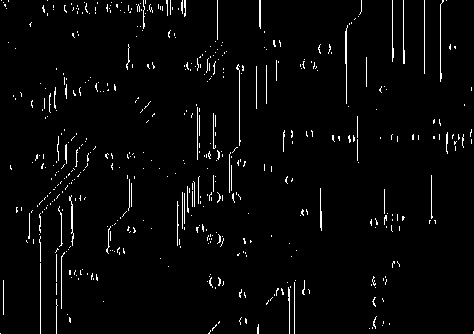
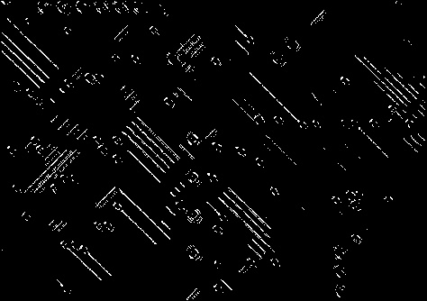

# HW16

原图


## Problem 1

the isolated point in gray-scale image



## Problem 2

the isolated point in color image



## Problem 3

the horizontal line


the vertical line



the -45 degree line 



## Code

```Python
import cv2
import numpy as np

# 读取灰度图像
gray_img = cv2.imread('4.jpg', cv2.IMREAD_GRAYSCALE)

# 1) 检测灰度图像中的孤立点
def detect_isolated_points_gray(image):
    laplacian = cv2.Laplacian(image, cv2.CV_64F)
    abs_lap = np.absolute(laplacian)
    _, thresholded = cv2.threshold(abs_lap, 30, 255, cv2.THRESH_BINARY)
    return np.uint8(thresholded)

# 2) 检测彩色图像中的孤立点
def detect_isolated_points_color(image):
    gray = cv2.cvtColor(image, cv2.COLOR_BGR2GRAY)

    # 拉普拉斯算子检测孤立点
    laplacian = cv2.Laplacian(gray, cv2.CV_64F)
    abs_lap = np.absolute(laplacian)
    _, mask = cv2.threshold(abs_lap, 30, 255, cv2.THRESH_BINARY)
    mask = np.uint8(mask)

    # 创建彩色掩码图
    isolated_color = cv2.bitwise_and(image, image, mask=mask)

    return isolated_color


# 3) 检测不同方向的线条（电路板）
def detect_lines(image):
    gray = cv2.cvtColor(image, cv2.COLOR_BGR2GRAY)

    # 方向性滤波器
    horizontal_kernel = np.array([
        [-1, -1, -1],
        [ 2,  2,  2],
        [-1, -1, -1]
    ])

    vertical_kernel = np.array([
        [-1,  2, -1],
        [-1,  2, -1],
        [-1,  2, -1]
    ])

    diag_kernel = np.array([
        [ 2, -1, -1],
        [-1,  2, -1],
        [-1, -1,  2]
    ])

    # 卷积滤波
    horizontal_resp = cv2.filter2D(gray, -1, horizontal_kernel)
    vertical_resp = cv2.filter2D(gray, -1, vertical_kernel)
    diag_resp = cv2.filter2D(gray, -1, diag_kernel)

    # 二值化提取明显线条
    _, h_bin = cv2.threshold(horizontal_resp, 100, 255, cv2.THRESH_BINARY)
    _, v_bin = cv2.threshold(vertical_resp, 100, 255, cv2.THRESH_BINARY)
    _, d_bin = cv2.threshold(diag_resp, 100, 255, cv2.THRESH_BINARY)

    return h_bin, v_bin, d_bin

# 加载彩色图像（用于任务2和3）
color_img = cv2.imread('4.jpg', cv2.IMREAD_COLOR)

# 保存结果图像
cv2.imwrite('gray_isolated_points.jpg', detect_isolated_points_gray(gray_img))
cv2.imwrite('color_isolated_points.jpg', detect_isolated_points_color(color_img))

sobel_h, sobel_v, diag_img = detect_lines(color_img)
cv2.imwrite('horizontal_lines.jpg', np.uint8(np.abs(sobel_h)))
cv2.imwrite('vertical_lines.jpg', np.uint8(np.abs(sobel_v)))
cv2.imwrite('diag_lines.jpg', diag_img)
```

