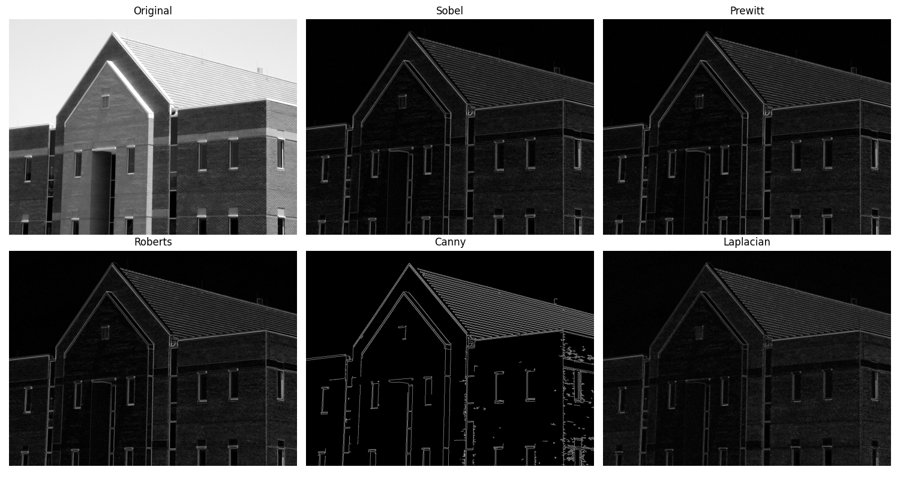
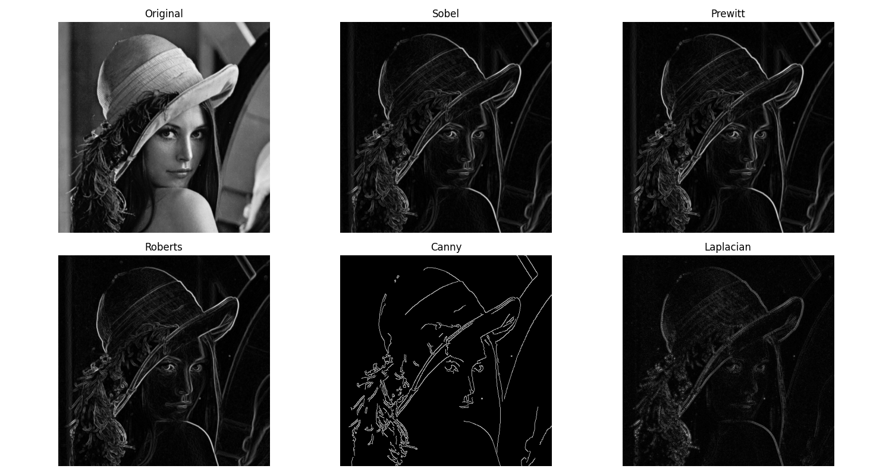

# HW16

## Problem 1



## Problem 2



## Code

```Python
import cv2
import numpy as np
import matplotlib.pyplot as plt
from skimage import filters, io, color
from skimage.filters import roberts, prewitt, sobel
import os

def process_and_save(image_path, output_name='result'):
    os.makedirs('output', exist_ok=True)

    img = cv2.imread(image_path)
    gray = cv2.cvtColor(img, cv2.COLOR_BGR2GRAY)

    blurred = cv2.GaussianBlur(gray, (3, 3), 0)

    sobel_edges = sobel(blurred)
    prewitt_edges = prewitt(blurred)
    roberts_edges = roberts(blurred)
    canny_edges = cv2.Canny(blurred, 100, 200)
    laplacian = cv2.Laplacian(blurred, cv2.CV_64F)
    laplacian = np.uint8(np.absolute(laplacian))

    titles = ['Original', 'Sobel', 'Prewitt', 'Roberts', 'Canny', 'Laplacian']
    images = [gray, sobel_edges, prewitt_edges, roberts_edges, canny_edges, laplacian]

    plt.figure(figsize=(15, 8))
    for i in range(6):
        plt.subplot(2, 3, i+1)
        plt.imshow(images[i], cmap='gray')
        plt.title(titles[i])
        plt.axis('off')
    plt.tight_layout()

    save_path = os.path.join('output', f'{output_name}.png')
    plt.savefig(save_path)
    plt.close()
    print(f"Saved: {save_path}")

process_and_save('Fig1.tif', 'Fig1_edges')
process_and_save('Fig2.tif', 'Fig2_edges')
```

