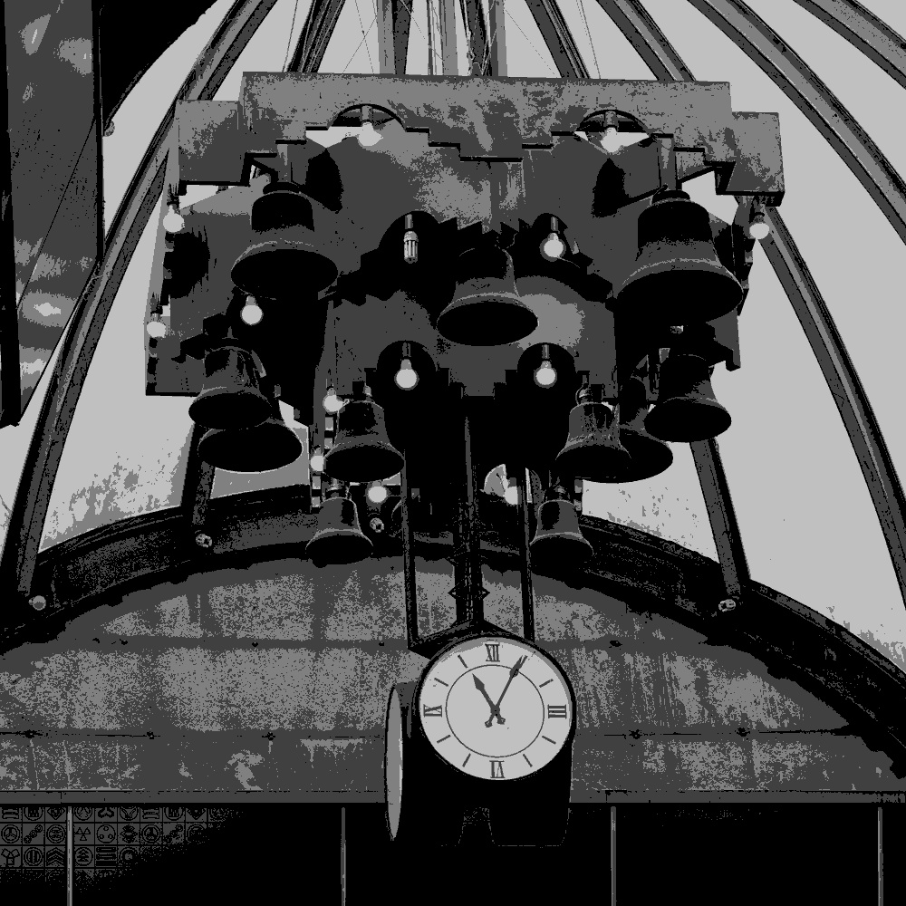
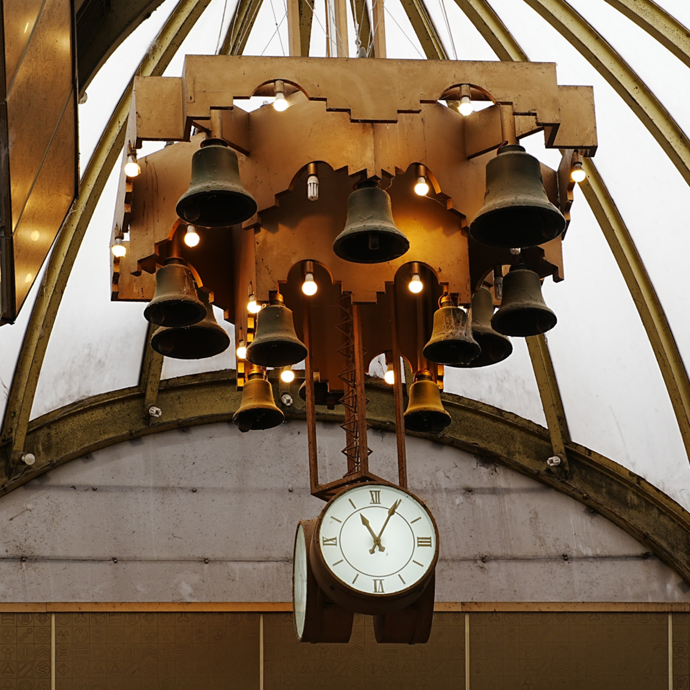
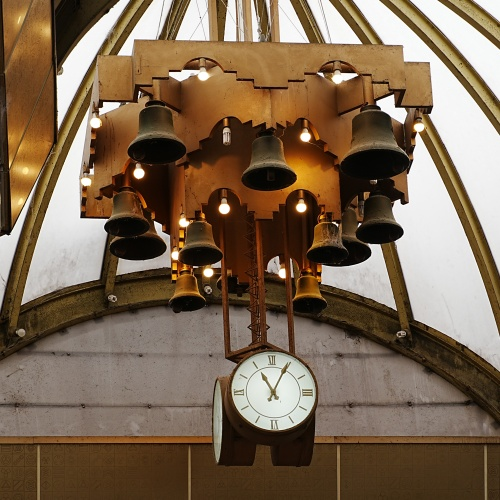
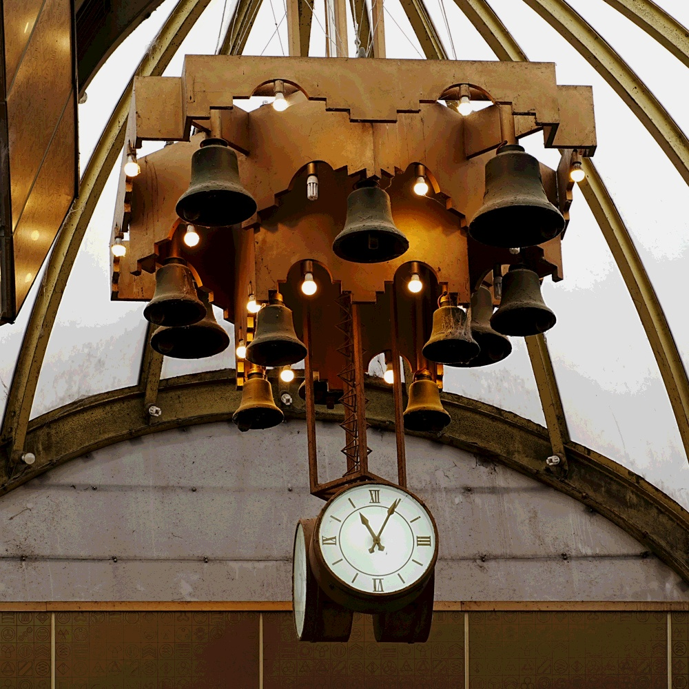
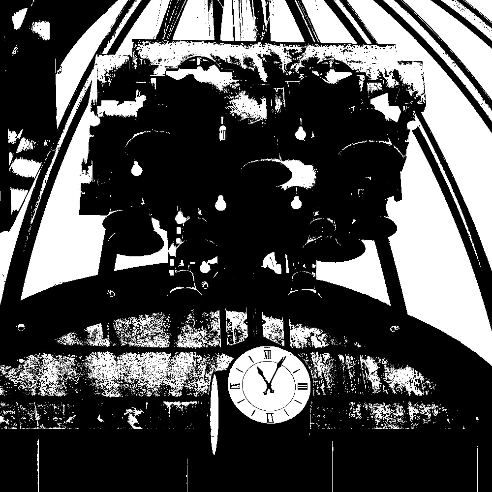

# HW3

## Problem 1

对于 $256$ 个 $gray\ level$，因为 $2^8=256$，不难发现其位深为 $8bit(1Byte)$，因此对于 

- $1024*1024$

  其图片大小为 $1024*1024 Byte = 1024KB = 1MB$

- $512*1024$

  其图片大小为 $512*1024 Byte = 512KB = 0.5MB$

## Problem 2

对于某 $JPG$ 格式照片，其具有如下参数：

- 分辨率：$6192*4128$
- 位深度：$24$
- 大小：$15.9MB$

根据计算，理论大小应为 $6192*4128*3 = 76681728Byte = 74884.5 KB = 73.1MB$，不难发现其比实际占用大小大了很多，这是因为 $JPG$ 格式是有损压缩，具有较高的压缩率。

## Problem 3

棋盘格和黑白图像实现代码如下

```Python
import cv2
import numpy as np

image = cv2.imread("1.jpg", cv2.IMREAD_COLOR)

scale_factor = 0.1  
small_img = cv2.resize(image, (0, 0), fx=scale_factor, fy=scale_factor, interpolation=cv2.INTER_NEAREST)
restored_img = cv2.resize(small_img, (image.shape[1], image.shape[0]), interpolation=cv2.INTER_NEAREST)
cv2.imwrite("output_lowres.jpg", restored_img)  

image = cv2.imread("1.jpg", cv2.IMREAD_GRAYSCALE)

levels = 4 
quantized_img = (image // (256 // levels)) * (256 // levels)
cv2.imwrite("output_quantized.jpg", quantized_img)  
```

原图


棋盘格


黑白图像



## Problem 4

分别使用最近邻插值和双线性插值缩放的实现代码如下
```Python
import cv2

image = cv2.imread("1.jpg", cv2.IMREAD_COLOR)

scale_up = 2.0   
scale_down = 0.5 

zoom_nn = cv2.resize(image, (0, 0), fx=scale_up, fy=scale_up, interpolation=cv2.INTER_NEAREST)
shrink_nn = cv2.resize(image, (0, 0), fx=scale_down, fy=scale_down, interpolation=cv2.INTER_NEAREST)

zoom_bilinear = cv2.resize(image, (0, 0), fx=scale_up, fy=scale_up, interpolation=cv2.INTER_LINEAR)
shrink_bilinear = cv2.resize(image, (0, 0), fx=scale_down, fy=scale_down, interpolation=cv2.INTER_LINEAR)

cv2.imwrite("zoom_nearest.jpg", zoom_nn)       
cv2.imwrite("shrink_nearest.jpg", shrink_nn)   
cv2.imwrite("zoom_bilinear.jpg", zoom_bilinear) 
cv2.imwrite("shrink_bilinear.jpg", shrink_bilinear) 
```

原图与上面 Problem 3 中相同。

使用最近邻插值放大得到的图像为



使用最近邻插值缩小得到的图像为


使用双线性插值放大得到的图像为


使用双线性插值缩小得到的图像为



## *Problem 5

此部分需要对图像的位深进行压缩，实现代码如下

```Python
import cv2
import numpy as np

image = cv2.imread("1.jpg", cv2.IMREAD_COLOR)

levels_4bit = 16
image_4bit = (image // (256 // levels_4bit)) * (256 // levels_4bit)
cv2.imwrite("output_4bit.jpg", image_4bit)

gray_image = cv2.cvtColor(image, cv2.COLOR_BGR2GRAY)
_, image_1bit = cv2.threshold(gray_image, 128, 255, cv2.THRESH_BINARY)  
cv2.imwrite("output_1bit.jpg", image_1bit)
```

其中第二部分转换为 $1bit$ 等价于二值化处理。

原图仍与上面 Problem 3 中相同。

转换为 $4bit$ 的图像为



转换为 $1bit$ 的图像为


