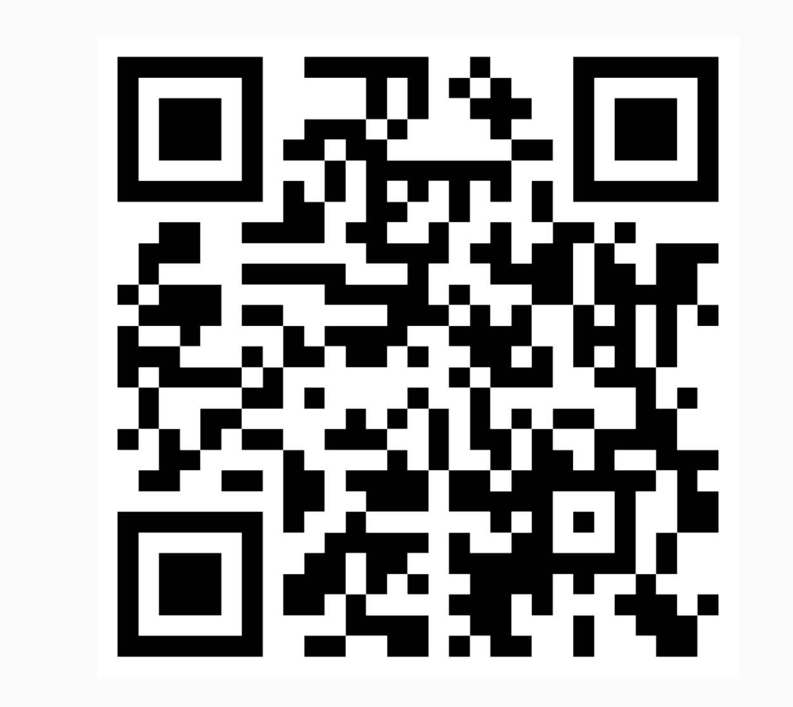
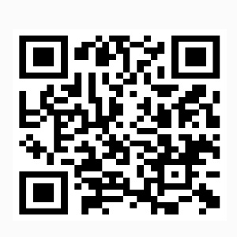
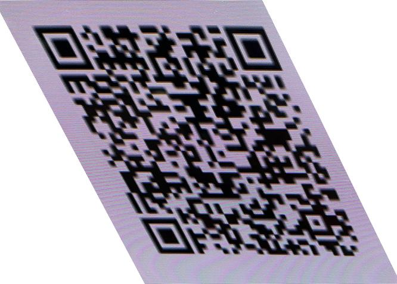
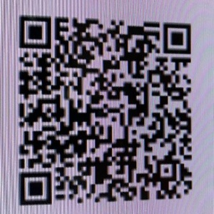
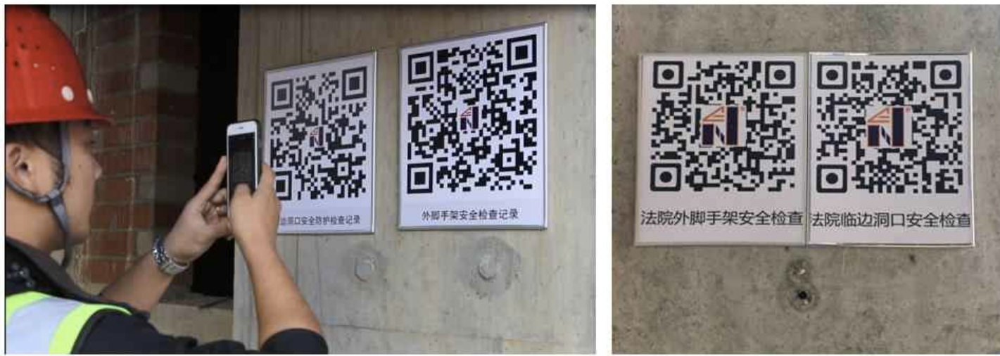
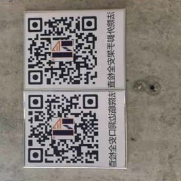

# QR Code

## 实验图片

### Group 1

- 原图

  

- 矫正

  

### Group 2

- 原图

  

- 矫正

  

### Group 3

- 原图

  

- 矫正

  

## 代码

```
import cv2
import numpy as np

def preprocess_image(image_path):
    img = cv2.imread(image_path)
    gray = cv2.cvtColor(img, cv2.COLOR_BGR2GRAY)

    blurred = cv2.GaussianBlur(gray, (5, 5), 0)
    thresh = cv2.adaptiveThreshold(blurred, 255, cv2.ADAPTIVE_THRESH_GAUSSIAN_C, cv2.THRESH_BINARY, 11, 2)
    
    return img, thresh

def find_qr_contour(thresh):
    contours, _ = cv2.findContours(thresh, cv2.RETR_TREE, cv2.CHAIN_APPROX_SIMPLE)
    largest_contour = None
    max_area = 0
    
    for cnt in contours:
        epsilon = 0.02 * cv2.arcLength(cnt, True)
        approx = cv2.approxPolyDP(cnt, epsilon, True)
        if len(approx) == 4:  # 选取四边形轮廓
            area = cv2.contourArea(approx)
            if area > max_area:
                max_area = area
                largest_contour = approx
    
    return largest_contour

def correct_qr_code(image_path, output_path):
    img, thresh = preprocess_image(image_path)
    qr_contour = find_qr_contour(thresh)
    
    if qr_contour is not None:
        qr_contour = qr_contour.reshape(4, 2).astype(np.float32)

        size = 300
        dst_points = np.array([
            [0, 0], [size-1, 0], [size-1, size-1], [0, size-1]
        ], dtype=np.float32)

        M = cv2.getPerspectiveTransform(qr_contour, dst_points)

        corrected = cv2.warpPerspective(img, M, (size, size))

        cv2.imwrite(output_path, corrected)
        print("矫正后的二维码已保存至:", output_path)
    else:
        print("未能检测到二维码。")

correct_qr_code("qr1.jpg", "corrected_qr1.jpg")
correct_qr_code("qr2.jpg", "corrected_qr2.jpg")
correct_qr_code("qr3.jpg", "corrected_qr3.jpg")
```

