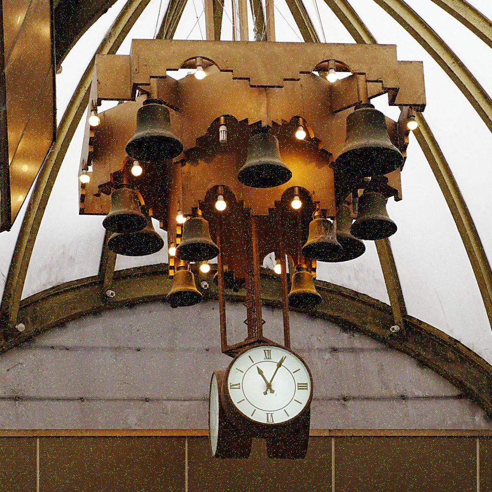
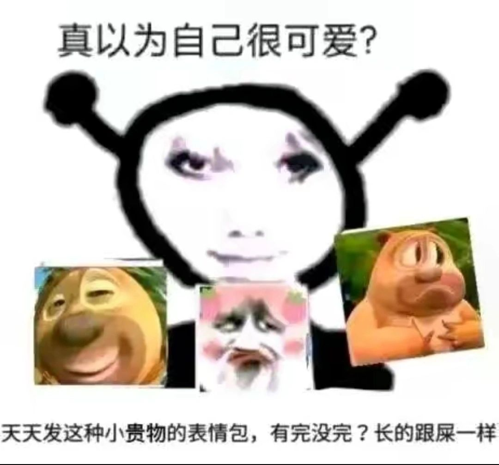
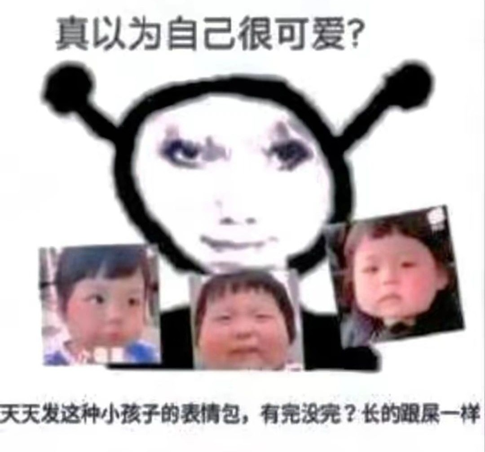
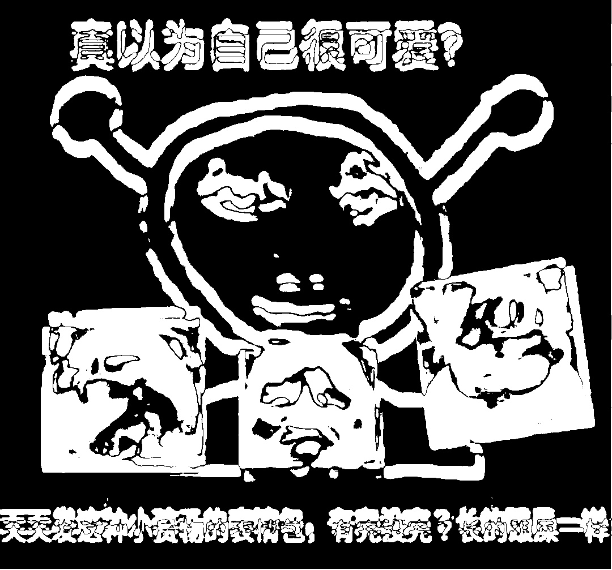
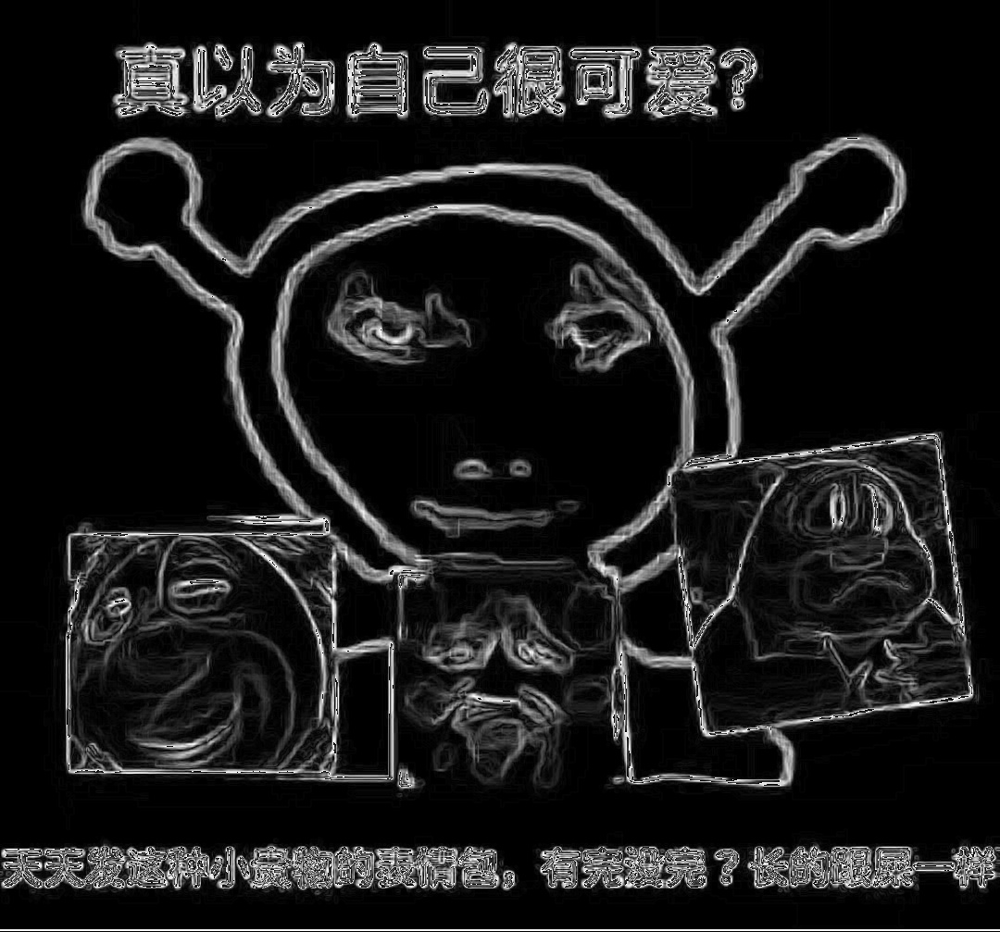
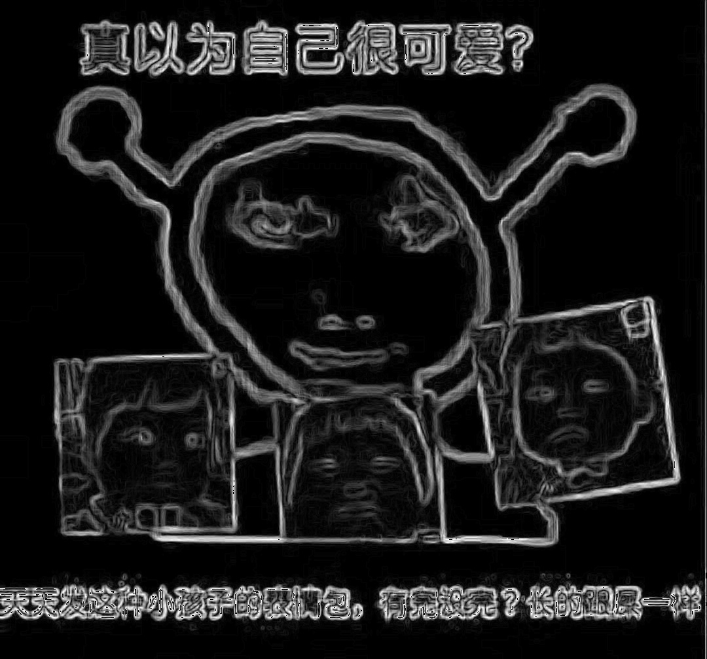
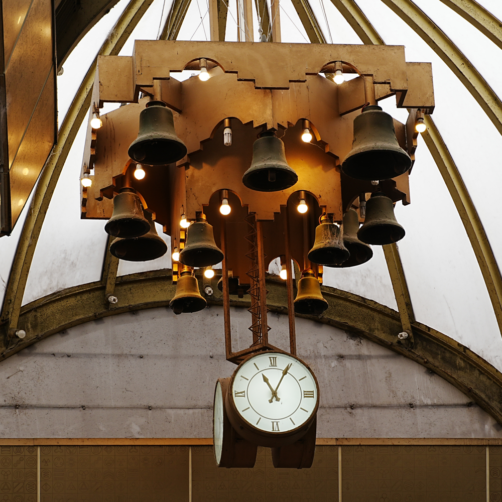
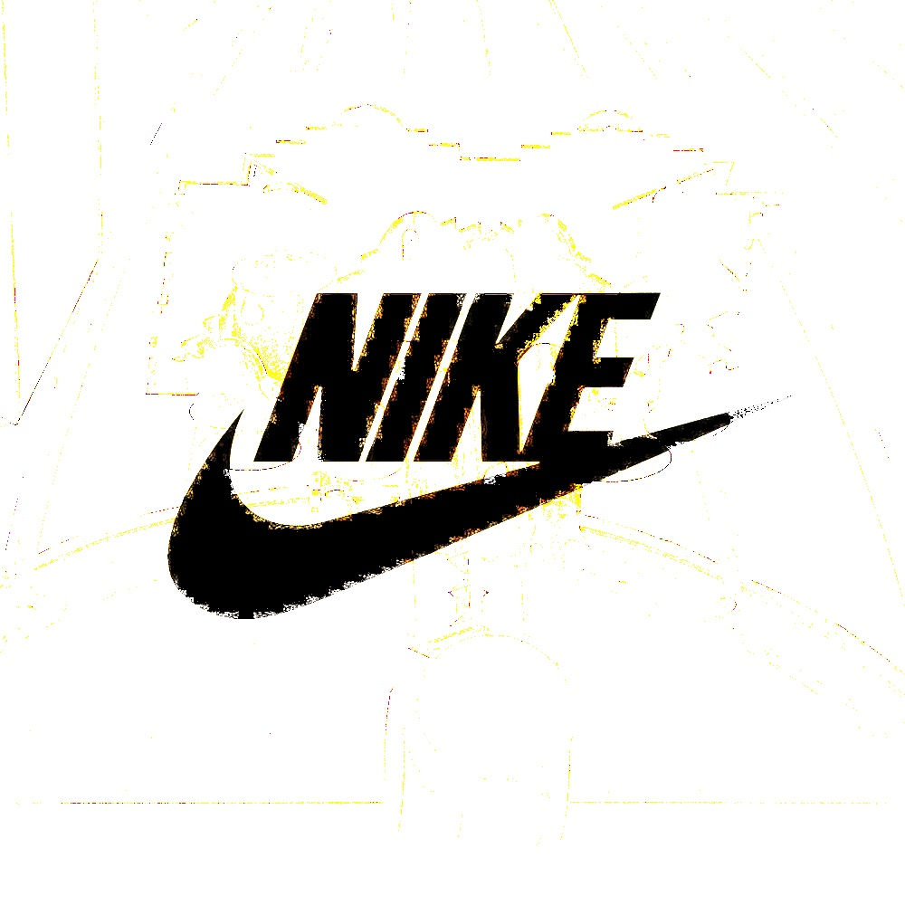
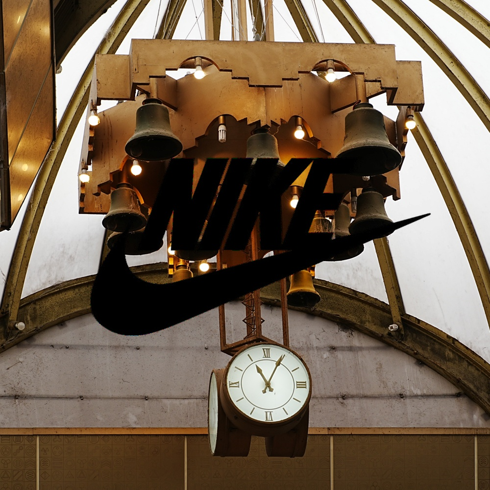

# HW4

## Problem 1

噪声图片



去噪图片


## Problem 2

原图





Diff图



图1边缘



图2边缘



## Problem 3

原图



logo图


logo与原图相乘



## Problem 4

and图



or图


## 代码

```Python

import cv2
import numpy as np

#Problem 1
image = cv2.imread("noise.jpg")

denoised = cv2.medianBlur(image, 5)


cv2.imwrite("Denoised.jpg", denoised)

#Problem 2
import cv2
import numpy as np

image1 = cv2.imread("2.jpg")
image2 = cv2.imread("3.jpg")

if image1.shape != image2.shape:
    print("Error: 图片尺寸不匹配")
    exit()

diff = cv2.absdiff(image1, image2)
gray_diff = cv2.cvtColor(diff, cv2.COLOR_BGR2GRAY)
_, thresh_diff = cv2.threshold(gray_diff, 30, 255, cv2.THRESH_BINARY)
cv2.imwrite("Difference.jpg", thresh_diff)

def gradient_edge_detection(image):
    gray = cv2.cvtColor(image, cv2.COLOR_BGR2GRAY)
    sobel_x = cv2.Sobel(gray, cv2.CV_64F, 1, 0, ksize=3)
    sobel_y = cv2.Sobel(gray, cv2.CV_64F, 0, 1, ksize=3)
    sobel_edge = cv2.magnitude(sobel_x, sobel_y)
    sobel_edge = np.uint8(sobel_edge)
    return sobel_edge

edges1 = gradient_edge_detection(image1)
edges2 = gradient_edge_detection(image2)

cv2.imwrite("Edge1.jpg", edges1)
cv2.imwrite("Edge2.jpg", edges2)

cv2.waitKey(0)
cv2.destroyAllWindows()

# Problem 3

logo = cv2.imread("logo.jpg", cv2.IMREAD_COLOR)
image = cv2.imread("1.jpg", cv2.IMREAD_COLOR)

if logo.shape != image.shape:
    print("Error: 图片尺寸不匹配")
    exit()

result = cv2.multiply(image, logo)

cv2.imwrite("multi.jpg", result)

# Problem 4
image = cv2.imread("1.jpg", cv2.IMREAD_COLOR)
logo = cv2.imread("logo.jpg", cv2.IMREAD_COLOR)

if image.shape != logo.shape:
    print("Error: 图片尺寸不匹配")
    exit()

and_result = cv2.bitwise_and(image, logo)
or_result = cv2.bitwise_or(image, logo)

cv2.imwrite("AND_result.jpg", and_result)
cv2.imwrite("OR_result.jpg", or_result)
```

