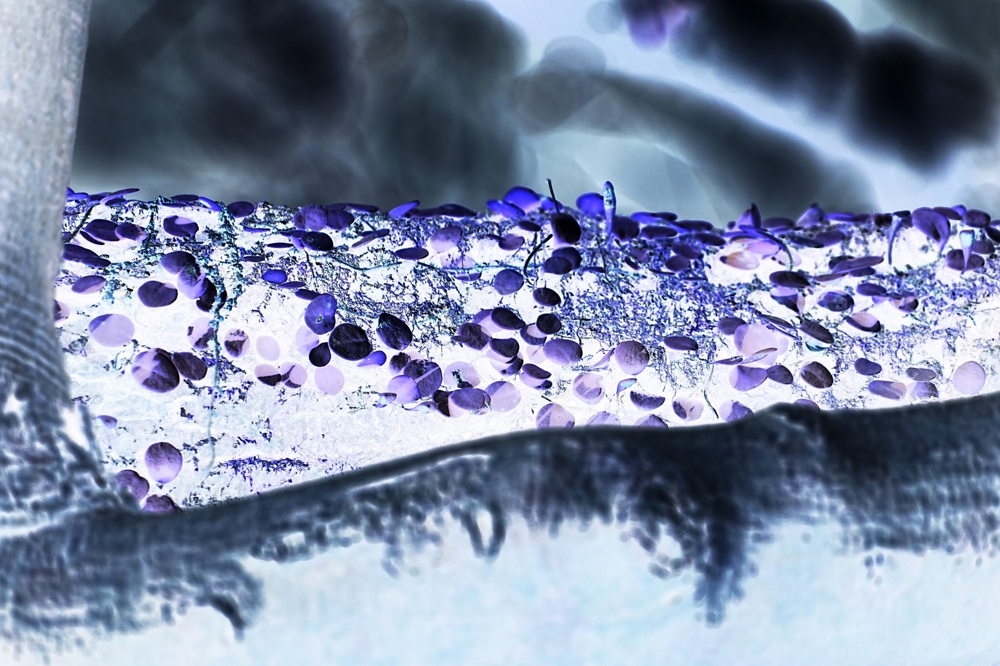

# HW 5

原图


## Problem 1

Negative Transformation



## Problem 2

Log Transformation


## Problem 3

Nth-power Transformation (r>1)


Nth-power Transformation (r<1)


## Problem 4

Piecewise-linear Transformation


## 代码

```
import cv2
import numpy as np

image = cv2.imread("1.jpg")

negative_image = 255 - image

c = 255 / np.log(1 + np.max(image))
log_transformed = c * np.log(1 + image.astype(np.float32))
log_transformed = np.clip(log_transformed, 0, 255).astype(np.uint8)

gamma_r_greater = 2.0
gamma_r_smaller = 0.5
image_float = image.astype(np.float32) / 255

power_transformed_greater = np.power(image_float, gamma_r_greater) * 255
power_transformed_greater = np.clip(power_transformed_greater, 0, 255).astype(np.uint8)

power_transformed_smaller = np.power(image_float, gamma_r_smaller) * 255
power_transformed_smaller = np.clip(power_transformed_smaller, 0, 255).astype(np.uint8)

a, b = 50, 30
c, d = 200, 220

piecewise_transformed = np.zeros_like(image, dtype=np.uint8)

mask1 = (image <= a)
mask2 = (image > a) & (image <= c)
mask3 = (image > c)

piecewise_transformed[mask1] = (b / a) * image[mask1]
piecewise_transformed[mask2] = ((d - b) / (c - a)) * (image[mask2] - a) + b
piecewise_transformed[mask3] = ((255 - d) / (255 - c)) * (image[mask3] - c) + d

cv2.imwrite("negative_1.jpg", negative_image)
cv2.imwrite("log_transformed_1.jpg", log_transformed)
cv2.imwrite("power_transformed_greater.jpg", power_transformed_greater)
cv2.imwrite("power_transformed_smaller.jpg", power_transformed_smaller)
cv2.imwrite("piecewise_transformed.jpg", piecewise_transformed)
```

