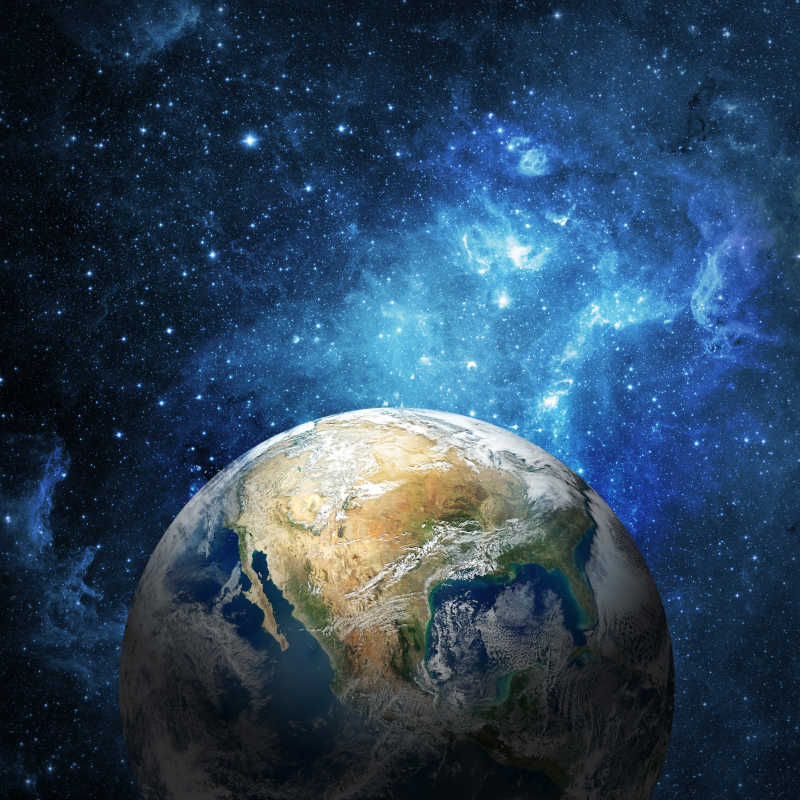
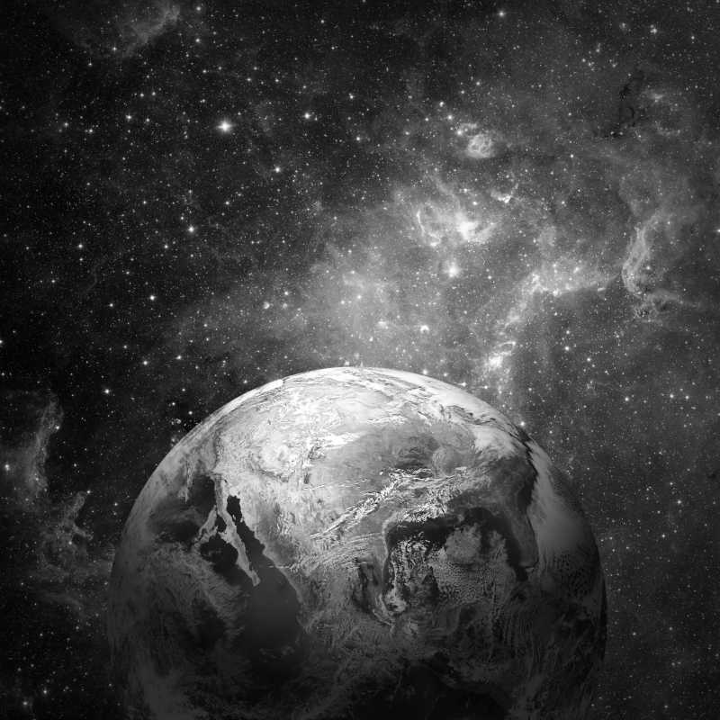
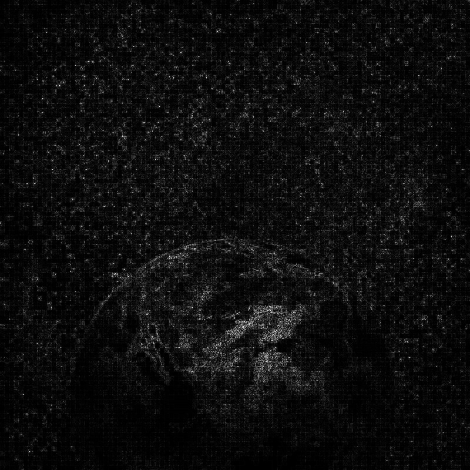
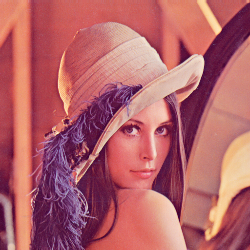
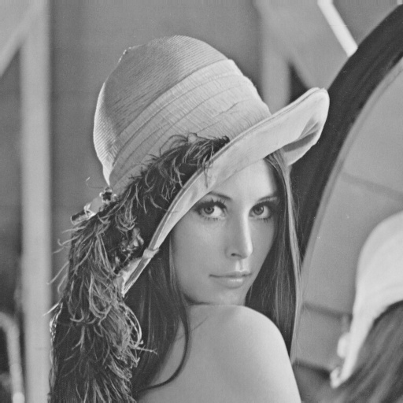
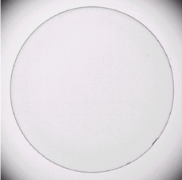
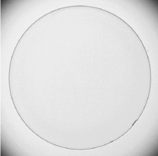
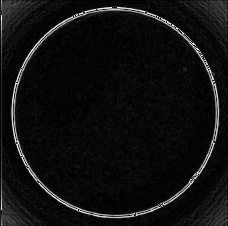

# HW8

## Problem 1

原图



灰度图



处理图



## Problem 2

原图



灰度图



处理图


## Problem 3



灰度图



处理图



## Code

```Python
import cv2
import numpy as np

space_img = cv2.imread('space.jpg', cv2.IMREAD_GRAYSCALE)
portrait_img = cv2.imread('portrait.png', cv2.IMREAD_GRAYSCALE)
industry_img = cv2.imread('industry.jpg', cv2.IMREAD_GRAYSCALE)

space_gray = cv2.imwrite('space_gray.jpg', space_img)
portrait_gray = cv2.imwrite('portrait_gray.jpg', portrait_img)
industry_gray = cv2.imwrite('industry_gray.jpg', industry_img)

# 1) Laplacian Mask 处理太空图片
laplacian = cv2.Laplacian(space_img, cv2.CV_64F)
laplacian = np.uint8(np.abs(laplacian))
cv2.imwrite('space_laplacian.jpg', laplacian)

# 2) Unsharp Mask 处理印刷业女人头像图片
blurred = cv2.GaussianBlur(portrait_img, (5, 5), 1.0)
unsharp = cv2.addWeighted(portrait_img, 1.5, blurred, -0.5, 0)
cv2.imwrite('portrait_unsharp.jpg', unsharp)

# 3) Sobel 算子处理工业产品的缺陷图片
sobelx = cv2.Sobel(industry_img, cv2.CV_64F, 1, 0, ksize=3)
sobely = cv2.Sobel(industry_img, cv2.CV_64F, 0, 1, ksize=3)
sobel = cv2.magnitude(sobelx, sobely)
sobel = np.uint8(sobel)
cv2.imwrite('industry_sobel.jpg', sobel)
```

