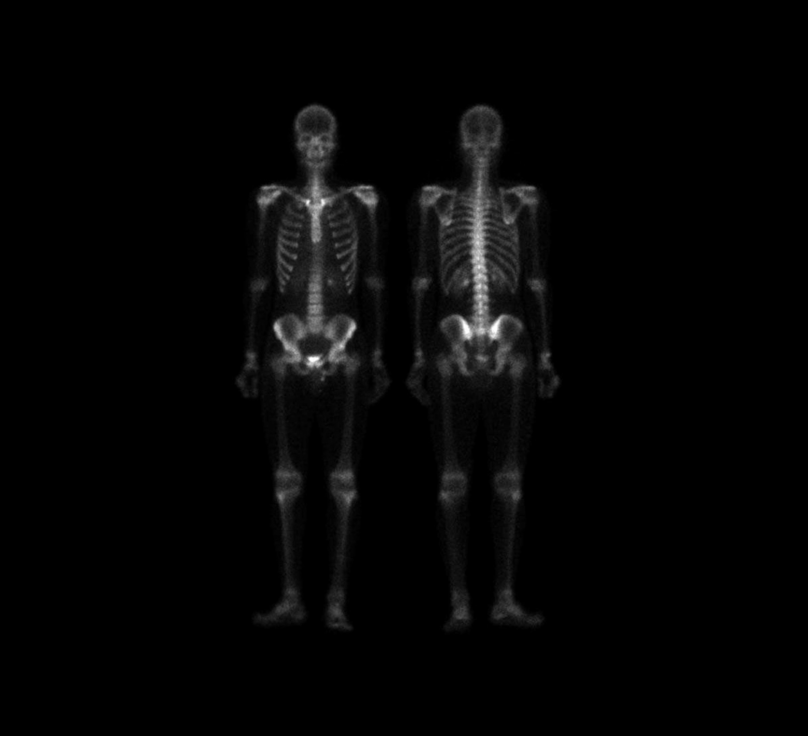
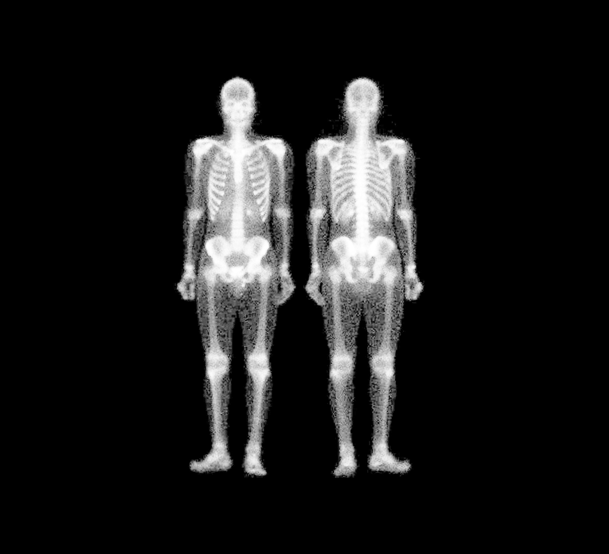
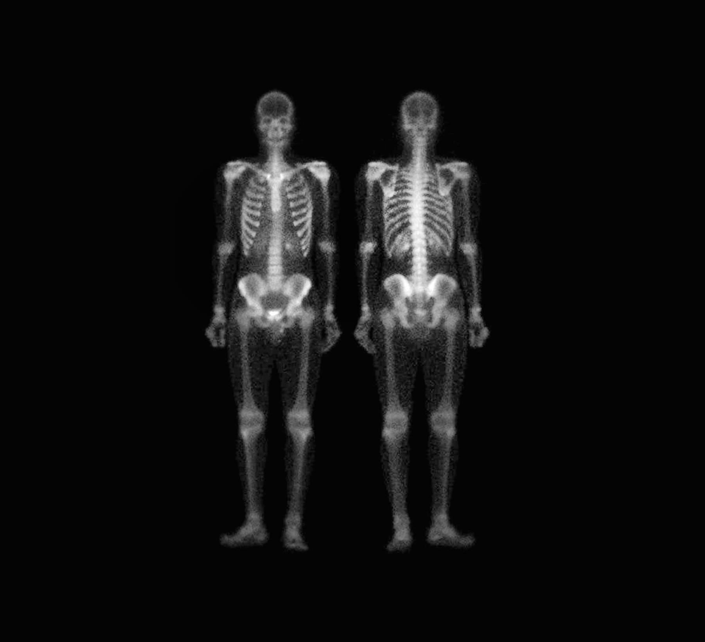

# HW9

原图



## Problem 1

使用书上的方法（混合空间增强法）处理骨骼数据



## Problem 2

使用自适应直方图均衡化处理骨骼数据



## Code

```python
import cv2
import numpy as np

image = cv2.imread("1.jpg", cv2.IMREAD_GRAYSCALE)

equalized = cv2.equalizeHist(image)
laplacian = cv2.Laplacian(equalized, cv2.CV_64F)
laplacian = cv2.convertScaleAbs(laplacian)
blurred = cv2.GaussianBlur(equalized, (5, 5), 0)
sharpened = cv2.addWeighted(equalized, 1.5, blurred, -0.5, 0)

def gamma_correction(img, gamma=1.5):
    invGamma = 1.0 / gamma
    table = np.array([(i / 255.0) ** invGamma * 255 for i in np.arange(0, 256)]).astype("uint8")
    return cv2.LUT(img, table)

gamma_corrected = gamma_correction(sharpened, gamma=1.5)

cv2.imwrite("skeleton_enhanced.jpg", gamma_corrected)

clahe = cv2.createCLAHE(clipLimit=3.0, tileGridSize=(8, 8))
clahe_image = clahe.apply(image)
cv2.imwrite("skeleton_clahe.jpg", clahe_image)
```

