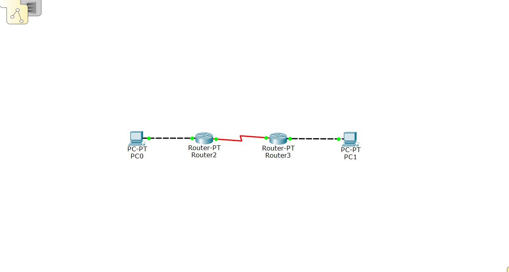

## 网络拓扑构建

按照如下所示构建网络拓扑，路由器选择 1240 右侧的 Generic，PC 选择第一个。路由器之间使用 Serial DCE 连接两个 Serial 端口，路由器与 PC 之间使用 Copper Straight-Through 连接 RS232 端口和 FastEthernet 端口。配置完成后将所需端口打开。



## 终端和路由器配置

对于 PC0，选择 Desktop，配置静态 IP 数据

- ipv4: `192.168.1.10`
- 子网掩码默认生成: `255.255.255.0`
- 默认网关即路由器: `192.168.1.1`

对于 PC1，同样进行配置

- ipv4: `192.168.3.10`
- 子网掩码默认生成: `255.255.255.0`
- 默认网关即路由器: `192.168.3.1`

配置连接 PC0 的路由器 R0

- FastEthernet

  - ipv4: `192.168.1.1`
  - 子网掩码默认生成: `255.255.255.0`
  
- Serial

  - 时钟频率: `9600`

  - ipv4: `192.168.2.1`
  - 子网掩码默认生成: `255.255.255.0`

对于 R1，同样进行配置

- FastEthernet

  - ipv4: `192.168.3.1`
  - 子网掩码默认生成: `255.255.255.0`

- Serial

  - 时钟频率: `9600`

  - ipv4: `192.168.2.2`
  - 子网掩码默认生成: `255.255.255.0`

此时网络拓扑构建完成，两台 PC 均可以访问自身及相连接的路由器，但仍无法访问另一台路由器及其所连接的 PC，仍需要进行路由器静态路由配置。

## 静态路由配置

先进入特权模式对 R0 进行配置，使用 `show ip rou` 对路由进行查询，应显示

```
C    192.168.1.0/24 is directly connected, FastEthernet0/0
C    192.168.2.0/24 is directly connected, Serial2/0
```

说明 R0 已经连接到 `192.168.1.0` 网段和 `192.168.2.0` 网段。进入配置模式，使用 `ip route 192.168.3.0 255.255.255.0 192.168.2.2` 对 `192.168.3.0` 网段进行静态路由的链接。再次查询路由表，就能获得

```
C    192.168.1.0/24 is directly connected, FastEthernet0/0
C    192.168.2.0/24 is directly connected, Serial2/0
S    192.168.3.0/24 [1/0] via 192.168.2.2
```

表明路由更新成功。

继续对 R1 进行配置，类似地，使用 `ip route 192.168.1.0 255.255.255.0 192.168.2.1` 就能够对静态路由及逆行配置。更新路由表后，应显示

```
S    192.168.1.0/24 [1/0] via 192.168.2.1
C    192.168.2.0/24 is directly connected, Serial2/0
C    192.168.3.0/24 is directly connected, FastEthernet0/0
```

此时两台终端可以互相 ping 通。

## 附1：路由器模式更改

提示符为 `Router>`: 用户模式

提示符为 `Router#`: 特权模式，用户模式下使用 `enable` 命令进入

提示符为 `Router(config)#`: 全局模式，特权模式下使用 `configure terminal` 命令进入

提示符为 `Router(config-if)#`: 端口模式，全局模式下使用 `interface [port]` 命令进入，`[port]` 是端口，如 `FastEthernet 0/0`

提示符为 `Router(config-line)#`: 线路模式

提示符为 `Router(config-router)#`: 路由模式

`exit` 命令退回到上一级操作模式；`end` 命令直接退回到特权模式。

## 附2：CLI 操作

也可以使用 CLI 对路由器进行基本配置，下面简单举例。

地址配置: 先使用 `int fa 0/1` 进入 `FastEthernet 1/0` 端口，输入 `ip address 192.168.114.1 255.255.255.0` 分别配置 ipv4 和子网掩码。

静态路由配置: 先使用 `int serial 2/0` 进入 `Serial 2/0` 端口，输入 `ip address 192.168.514.1 255.255.255.0 ` 分别配置 ipv4 和子网掩码，然后使用 `clock rate 9600` 配置时钟频率，并用 `ip route 192.168.100.0 255.255.255.0 192.168.514.2` 配置路由表即可。
